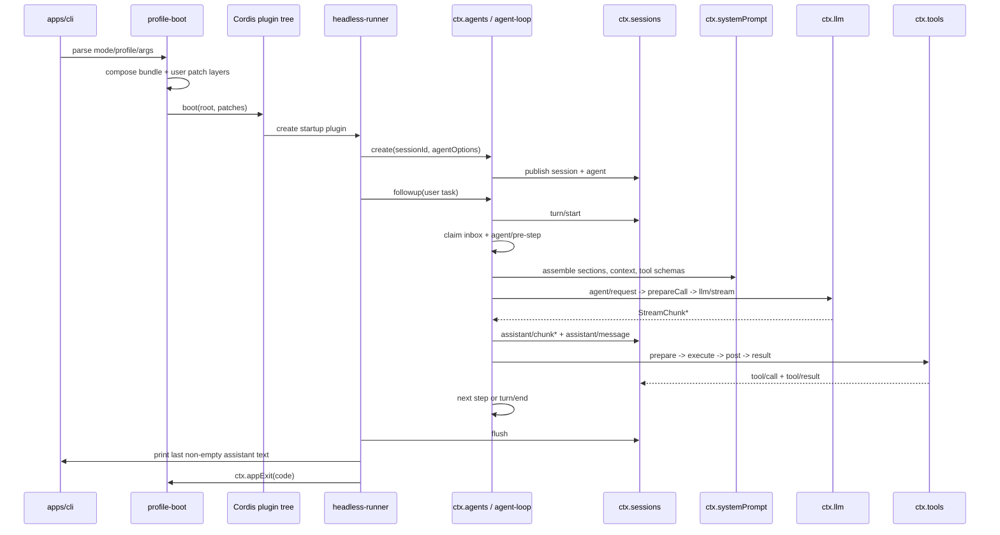

# DeepSeek Harness 源码精读

## Everything is a Plugin：从一次 `dsh` 命令到可回放 Agent

> 分析对象：[`deepseek-ai/deepseek-harness`](https://github.com/deepseek-ai/deepseek-harness)
>
> 源码版本：`master`，提交 `47f943859bef60e4160492346772ded9b24f765a`
>
> 版本信息：`0.1.0-rc.5`，2026-08-13
>
> 表达方式参考：[《第 3 章：Agent Loop》](https://dg-ai-notes.pages.dev/modules/ch03-agent-loop/)
>
> 适合读者：已经了解 TypeScript、异步编程和 LLM 基本调用，希望从源码理解 Agent harness 的读者。

这份资料参考了 Agent Loop 教程常用的讲法：先回答“为什么这样设计”，再画出一次运行的全景，最后沿真实源码逐段解释。但它不会把 DeepSeek Harness 套进另一个项目的术语。尤其要先记住一处关键差异：在本仓库里，一个 `turn` 可以包含多个 `step`；一个 `step` 才是“一次模型请求加上本次请求产生的工具调度”。

这里的 harness 指 Agent 的运行、扩展和隔离框架，不是单纯的 benchmark runner。

---

## 一、先给结论：它不是一个大循环，而是一棵可替换的插件树

DeepSeek Harness（命令名 `dsh`）的核心主张不是“写一个更复杂的 while 循环”，而是：

```text
插件 = 服务 + 事件 + 可逆注册
运行时 = Cordis 上下文中的插件树
Agent = 会话日志之上的一个有状态驱动器
```

因此模型适配器、提示词、工具、会话日志、审批、沙箱、子 Agent、Web UI 和 Agent Loop 都不是特权内核里的硬编码分支，而是可以被配置树替换、覆盖或卸载的插件。

可以把它和三种常见模型调用方式对比：

| 方式 | 谁决定下一步 | 状态在哪里 | 适合场景 |
| --- | --- | --- | --- |
| 直接调用 | 调用方代码 | 调用栈或临时变量 | 问答、摘要 |
| Workflow | 预先写好的流程 | 工作流状态 | 固定的多步任务 |
| Harness Agent | 模型输出、队列和事件策略共同决定 | 可回放 Session 日志 | 编程助手、交互式自动化 |

Harness 的循环仍然有 `while`，但它只是产品行为的一个实现插件。真正稳定的抽象是：

1. `ctx.agents` 提供公开 Agent 句柄和创建/恢复工厂。
2. `ctx.sessions` 保存追加式会话事实。
3. `ctx.systemPrompt` 在每个步骤组装系统文本、动态上下文和工具 schema。
4. `ctx.llm` 把一次请求转换为流式分片。
5. `ctx.tools` 对工具调用执行验证、策略、审批、运行和结果定型。
6. `agent/*` 与 `session/event` 让插件和 UI 在不依赖具体实现的情况下观察或拦截运行。

### 读源码时最重要的三条边界

**第一条：`Agent` 是公共接口，`ReactLoopAgent` 是实现细节。** 消费方应该依赖 `ctx.agents`，而不是直接构造 `ReactLoopAgent`。

**第二条：Session 日志是模型上下文的真源。** 模型下一次看到的消息由日志投影得到，而不是由一个容易漂移的 `messages` 数组私下维护。

**第三条：插件通过扩展点加行为。** 新策略优先监听 `agent/pre-step`、`agent/request`、`tools/pre-execute` 等事件，而不是修改循环本身。

---

## 二、如何运行：先看一条最短路径

### 2.1 从发布包运行

```sh
npx @deepseek-ai/dsh web
```

默认启动 Web UI：`http://127.0.0.1:3080`。

### 2.2 从源码运行

```sh
git clone https://github.com/deepseek-ai/deepseek-harness.git
cd deepseek-harness
pnpm install
pnpm run build
pnpm dsh web
```

源码要求 Node `^22.19.0 || >=24.0.0`，包管理器是 `pnpm@11.7.0`。

### 2.3 用 headless 模式观察一次性任务

```sh
DEEPSEEK_API_KEY=... pnpm dsh --profile headless "读取 README.md 并总结项目结构"
```

`headless` 不启动 Host、HTTP server 或浏览器。它读取命令行任务，创建一个 Agent，提交一条普通用户消息，等待 Agent 完全空闲，刷新 Session，然后打印最后一条非空 assistant 文本。

### 2.4 Dump 实际插件树

```sh
dsh --profile web --dump-config
```

这个命令非常适合源码学习：你看到的不是“理论上的默认值”，而是当前 profile、bundle、用户 patch 和 overlay 合并后的实际条目。

---

## 三、仓库地图：从产品入口走到循环内核

根目录 `AGENTS.md` 已经给出了很好的分层。阅读时建议按下面这条主线，而不要从 8,000 多个文件中随机跳转。

| 目录 | 关键职责 | 首读文件 |
| --- | --- | --- |
| `apps/cli` | `dsh` 命令行入口、profile 启动、进程退出 | `src/bin.ts`、`src/profile-boot.ts` |
| `packages/boot/app-boot` | 读取 profile、加载 Cordis 配置、挂载插件树 | `src/index.ts`、`src/profile.ts` |
| `packages/bundle/base` | 所有 profile 共享的基础插件组合 | `cordis.patch.yml` |
| `packages/bundle/headless` | 一次性 Agent 任务组合 | `cordis.patch.yml` |
| `packages/core/agent` | Agent 公共接口、inbox、注册表、initiator 作用域 | `src/runtime-types.ts`、`src/inbox.ts` |
| `packages/core/agent-loop` | 唯一的默认循环实现 | `src/agent.ts`、`src/tool-calls.ts` |
| `packages/core/session` | 追加式日志、surface、消息投影 | `src/index.ts`、`src/surface.ts` |
| `packages/core/system-prompt` | Prompt section、动态 context、工具 schema 组装 | `src/index.ts` |
| `packages/core/tools` | 工具注册与执行流水线 | `src/index.ts`、`src/types.ts` |
| `packages/llm/llm` | provider/model、消息类型和流协议 | `src/index.ts`、`src/types.ts` |
| `packages/*/sandbox`、`subprocess`、`fs` | 执行世界与文件效果策略 | 对应 capability README |
| `docs` | 架构、生命周期、工具流水线、测试政策 | `architecture.zh.md`、`agent-lifecycle.zh.md` |

源码索引（固定提交）：

- [`apps/cli/src/bin.ts`](https://github.com/deepseek-ai/deepseek-harness/blob/47f943859bef60e4160492346772ded9b24f765a/apps/cli/src/bin.ts)
- [`apps/cli/src/profile-boot.ts`](https://github.com/deepseek-ai/deepseek-harness/blob/47f943859bef60e4160492346772ded9b24f765a/apps/cli/src/profile-boot.ts)
- [`packages/core/agent-loop/src/agent.ts`](https://github.com/deepseek-ai/deepseek-harness/blob/47f943859bef60e4160492346772ded9b24f765a/packages/core/agent-loop/src/agent.ts)
- [`packages/core/agent-loop/src/tool-calls.ts`](https://github.com/deepseek-ai/deepseek-harness/blob/47f943859bef60e4160492346772ded9b24f765a/packages/core/agent-loop/src/tool-calls.ts)
- [`packages/core/session/src/index.ts`](https://github.com/deepseek-ai/deepseek-harness/blob/47f943859bef60e4160492346772ded9b24f765a/packages/core/session/src/index.ts)

---

## 四、第一层心智模型：Cordis 插件运行时

DeepSeek Harness 使用 vendored Cordis。读 Cordis 时只需要先掌握五个词：

| 词 | 含义 |
| --- | --- |
| Plugin | 一个函数或 `Service` 子类，负责把能力安装到上下文 |
| Context | 服务和事件的容器，例如 `ctx.llm`、`ctx.tools` |
| `inject` | 声明依赖，依赖未就绪时插件不启动 |
| Event | 类型化通信，可选 `emit`、`waterfall`、`parallel`、`serial` |
| Effect | 可撤销的注册；卸载时调用 disposer |

### 4.1 四种事件模式

| 模式 | 调度方式 | 是否有返回值 | 典型用途 |
| --- | --- | --- | --- |
| `emit` | 同步调用，不等待 listener 返回的 Promise | 否 | 状态通知、日志观察 |
| `waterfall` | 同步组合 `next()` 链，返回值本身可以是 Promise | 是 | 中间件、策略决策、请求改写 |
| `parallel` | 并行启动并等待全部 listener 结算 | 否 | 独立观察者并行工作 |
| `serial` | 按注册顺序逐个等待，可在 bail 值处停止 | 是 | 需要顺序执行的最终检查 |

`waterfall` 的监听器收到 `next()`。调用 `next()` 才会把决定交给下游；不调用就会短路。比如 `agent/pre-step` 的一个策略插件可以直接返回 `{ kind: 'reject' }`，而只想附加信息的监听器必须继续调用 `next()`。

### 4.2 为什么“注册是副作用”很重要

假设一个插件注册了工具、提示词 section 和事件监听器：

```text
加载插件
  ├─ ctx.tools.register(...)      -> disposer A
  ├─ ctx.systemPrompt.section(...) -> disposer B
  └─ ctx.on('agent/request', ...) -> disposer C

卸载插件
  ├─ C()
  ├─ B()
  └─ A()
```

这样 HMR、profile patch 或 agent scope 销毁时，能力不会残留。仓库的工程规则把这件事视为基础不变量，而不是“最好记得清理”。

---

## 五、Profile 与 Bundle：运行时是怎样组装出来的

`dsh` 启动的不是一份固定 `cordis.yml`，而是一棵由 patch 叠加出来的树。

```text
空 profile 根 []
    │
    ├─ profile package.json 中 dsh.profile.bundles 的顺序
    │    └─ dsh-base
    │    └─ dsh-headless 或 dsh-web-app
    │
    ├─ profile 自己的 cordis.patch.yml
    ├─ $DSH_HOME/cordis.patch.yml
    ├─ 命令行 --patch overlay
    └─ telemetry 开关 patch
    │
    ▼
Loader 解析依赖并挂载 Cordis 插件树
```

`apps/cli/src/profile-boot.ts` 的 `composeProfile()` 负责收集层，`runProfile()` 负责调用 `boot()`。patch 按 `id` 定位条目；覆盖会替换目标行的完整 `config`，不是深度合并。这解释了两个常见现象：

- 一个模式需要不同配置时，应在模式 bundle 里重写整行，而不是把模式分支塞进 base。
- 用户 patch 能覆盖 bundle，但 patch 的对象必须写出想保留的字段。

### 5.1 `headless` 如何把产品行为插进基础树

基础 bundle 提供 `llm`、`session`、`agent`、`tools`、`system-prompt`、`agent-loop`、文件系统和沙箱等能力。headless bundle 额外做四件事：

1. 设置 coding-agent persona：`You are a coding agent powered by the {{model}} model...`。
2. 关闭共享 HMR 行，但启动器仍可用 watch-only 方式监听用户 patch。
3. 挂载 Code Mode worker。
4. 挂载 `headless-runner`，由它通过 `ctx.agents` 创建 Agent。

这是一种很有价值的架构信号：一次性运行器不是另写一套 Agent 实现，而是消费核心 Agent 服务。

---

## 六、一条 headless 消息的完整旅程

以命令为例：

```sh
dsh --profile headless "修复 tests/foo.test.ts 中的失败断言"
```

全景如下：



这条链路里有两类信息：

- **持久事实**：`turn/start`、`step/start`、`user/message`、`assistant/chunk`、`assistant/message`、`tool/call`、`tool/result`、`turn/end` 等 `session/event`。
- **实时协调**：`agent/status`、`agent/inbox/*`、`agent/pre-step`、`agent/request`、`tools/*` 等 `agent/*` 和能力事件。

UI 要重放对话，应该消费 Session 事件；要显示队列、拦截下一步或取消 Agent，才消费 `agent/*`。

---

## 七、两个容易混淆的单位：Turn 与 Step

### 7.1 本仓库的精确定义

**Step**：一次模型请求，加上该请求产生的所有工具调用和工具结果。

**Turn**：从 `turn/start` 到 `turn/end` 的一段工作；它可以因为工具 continuation、steering 或注入上下文而包含多个 Step。

```text
Turn 7
│
├─ Step 1
│   ├─ 领取用户消息
│   ├─ 调模型
│   ├─ assistant 返回 tool-call(read)
│   └─ 执行 read，tool/result 写入 Session
│
├─ Step 2
│   ├─ 从 Session 历史看到 tool/result，并领取 steering/additionalContexts
│   ├─ 再次调模型
│   ├─ assistant 返回 tool-call(edit)
│   └─ 执行 edit
│
└─ Step 3
    ├─ 调模型
    ├─ assistant 返回普通文本
    └─ turn/end
```

参考文章把一个“模型调用 + 工具执行”称为 Turn；那套定义适合另一种 Agent Loop，但不能直接用于本仓库。这里如果把 `step` 看成 `turn`，会误读 `turn-stopping`、取消和日志恢复逻辑。

### 7.2 Agent 的两条 inbox

`Agent` 有两个待处理列表：

| 队列 | API | 何时领取 | 典型来源 |
| --- | --- | --- | --- |
| `next-turn` | `followup()` | 新 Turn 开始时，最多领取一条 | 用户下一条独立任务、系统续跑 |
| `next-step` | `steer()` / `inject()` | 每个 Step 边界，全部领取 | 实时插话、工具附加的 `additionalContexts`、运行时注入 |

`Inbox.claim(target, turn)` 的顺序是：先取全部 `next-step`，如果当前是新 Turn，再取一条 `next-turn`。领取本身先写 `agent/inbox/spliced` 的纯删除事件，之后发出逐条 `agent/inbox/claimed`。

这带来一个重要语义：steering 不会粗暴打断正在运行的工具；它在下一步边界生效。`inject()` 也不会唤醒空闲 Agent，必须等 follow-up 或 steer 来打开驱动器。

普通 `tool/result` 不经过 inbox；它直接进入 Session surface，下一次 `deriveMessages()` 会读到它。工具调用让 `step()` 返回 `null`，这才是循环继续下一个 Step 的直接信号。只有工具额外返回的 `additionalContexts` 才进入 `next-step` inbox。

---

## 八、核心状态机：`ReactLoopAgent` 逐段拆解

源码：[`packages/core/agent-loop/src/agent.ts`](https://github.com/deepseek-ai/deepseek-harness/blob/47f943859bef60e4160492346772ded9b24f765a/packages/core/agent-loop/src/agent.ts)

### 8.1 阶段状态

```ts
type Phase =
  | { kind: 'idle'; lastTurn: number }
  | {
      kind: 'maintenance'
      abort: AbortController
      lastTurn: number
      wakeRequested: boolean
    }
  | {
      kind: 'running'
      abort: AbortController
      turn: number
      step: number
      wakeRequested: boolean
    }
```

公开的 `AgentStatus` 只有 `idle | running`；`maintenance` 对外仍表现为 idle。原因是维护任务不会发送模型请求，但 Agent 仍需要阻止另一个维护任务并发占用它。

`setPhase()` 只在公开状态发生变化时发 `agent/status`。因此一个 Agent 连续处理多个 follow-up Turn 时，不会在每个 Turn 之间伪造 idle。

### 8.2 唤醒与取消

`send()` 统一实现三种 API：

```ts
followup(input) // next-turn + wake
steer(input)   // next-step + wake
inject(input)  // next-step + no wake
```

取消有两个独立动作：

1. 默认清空 inbox，并 abort 当前活动。
2. `keepInbox: true` 时只 abort 当前活动，排队消息保留。

如果消息刚好在“旧活动已 abort、驱动器还没收敛到 idle”的窗口到达，`wakeRequested` 会记住这次唤醒，待 `kick()` 收尾后重放。`disposed` 原因不会锁存唤醒，因为销毁的 Agent 不应该再开启模型轮次。

### 8.3 外层循环：`kick()`

```ts
private async kick(): Promise<void> {
  try {
    while (await this.turn()) {}
  } catch (_error) {
    // error 已通过 agent/error 报告；在驱动器边界收敛
  } finally {
    // running -> idle；必要时重放 wakeRequested
  }
}
```

`turn()` 的布尔返回值表示“是否还有下一轮”。它不是把异常传播给调用者，而是让 Agent 自己在 `agent/error` 和 Session `turn/end` 中保留失败事实，保证驱动器不会变成未处理 Promise。

### 8.4 `turn()`：开边界、重复 Step、关边界

抽象后的伪代码：

```ts
async function turn(): Promise<boolean> {
  append('turn/start', { turn: nextTurn })
  let reason: TurnEndReason | null = null
  let target: InboxTarget = 'next-turn'

  while (true) {
    const decision = await preStep(target, { turn, step: nextStep })

    if (decision.kind === 'reject') {
      reason = { kind: 'blocked' }
      break
    }
    if (firstStep && decision.messages.length === 0) {
      reason = { kind: 'completed' }
      break
    }

    append('step/start', { turn, step })
    append each decision.messages as 'user/message'
    const stepEnd = await step(decision.assembly)
    append('step/end', { turn, step })

    if (stepEnd && nextStepInboxIsEmpty) {
      await serial('agent/turn-stopping')
    }
    if (stepEnd && nextStepInboxIsEmpty) break
    target = 'next-step'
  }

  append('turn/end', { turn, reason })
  return inbox.hasPending
}
```

两个细节很容易漏掉：

- 首次 `preStep` 领取 `next-step` 全部消息和 `next-turn` 一条消息；后续 Step 只领取 `next-step`。
- 第一个 step 被策略改写为空时，Turn 仍然存在并会记录 `turn/start`、`turn/end`，但不会产生模型请求。

`turn/end` 的内置原因如下；这是一个支持 declaration merging 的可扩展联合类型：

| `kind` | 来源 | 含义 |
| --- | --- | --- |
| `completed` | Loop | 自然结束，或 concluding tool 结束了 Turn |
| `max-tokens` | Loop | 至少一个 Step 达到输出 token 上限 |
| `blocked` | `agent/pre-step` | 首个或后续 Step 被策略拒绝 |
| `aborted` | Loop | 用户、父 Agent、hook 或 dispose 发起取消 |
| `error` | Loop | 结构化 `LlmFailure` 或归一化的未知错误 |
| `interrupted` | persistence repair | 重载时关闭崩溃遗留的开放 Turn；Loop 本身不产生 |

### 8.5 `turn-stopping` 是最终检查点

Step 返回 `completed` 或 `max-tokens` 且 `next-step` 为空时，循环先触发 serial 的 `agent/turn-stopping`。监听器可以在这里调用 `agent.steer()`，循环随后重新读取 inbox：

```text
模型无工具调用
    │
    ├─ next-step 为空 -> agent/turn-stopping
    │                    ├─ listener 没有 steer -> turn/end
    │                    └─ listener steer -> 再开一个 Step
    │
    └─ next-step 非空 -> 直接继续下一个 Step
```

这比“每个监听器都可以直接 return false 停止”更稳：最终结果由 inbox 数据决定，不由监听器注册顺序决定。

---

## 九、一个 Step 内发生什么

源码入口是 `agent.ts:332` 的 `step()`。

### 9.1 Prompt 组装与消息边界

```text
Session.deriveMessages()
        +
SystemPrompt.assemble()
        +
agent/request waterfall
        ↓
冻结的 GenerateOptions
```

每个 Step 都重新组装 system、动态 context 和 tools。这样 agent-scoped 插件可以在两步之间注册或卸载能力；代价是系统文本和 schema 可能重新计入输入 token。

### 9.2 流式请求

`step()` 创建 `BlockAssembler`，然后消费：

```ts
const stream = preparedCall?.stream(request) ?? ctx.llm.stream(request)

for await (const chunk of stream) {
  session.append('assistant/chunk', { turn, step, chunk })
  assembler.push(chunk)
}
```

`assistant/chunk` 是回放/UI 的增量事实，不直接进入模型历史。流结束后，assembler 给出 `finish` 和完整内容块，再写一条 `assistant/message`。该事件的 `sourceEventSeqs` 精确引用这次请求产生的 chunk 序号。

### 9.3 成功、工具调用与重试

```text
finish = error / aborted
    └─ agent/request-error waterfall
         ├─ { kind: 'retry' } -> 重新 buildRequest
         └─ undefined -> LlmError，结束当前 Turn

finish = max-tokens
    └─ assistant/message 已落盘，Step 返回 max-tokens

finish = stop
    ├─ 无 tool-call -> Step completed
    └─ 有 tool-call -> 执行工具，再进入下一 Step
```

`max-tokens` 具有 sticky 语义：同一 Turn 后续 Step 即使正常结束，也不能把最终结果降级为 `completed`。

---

## 十、请求是怎么构造出来的

`buildRequest()` 是理解“模型看到什么”的关键。它位于 `agent.ts:407` 附近。

### 10.1 从哪里得到 provider/model

首个请求从 `AgentOptions` 取 route；恢复会话时，可以从已记录的 `request/header` 恢复显式的 reasoning effort 等字段。适配器自动填入的默认值通过 `adapterDefaults` 标记，下一个 Step 重新解析当前确切模型，而不是把旧适配器默认值误当成用户显式配置。

### 10.2 `agent/request` 是配置 waterfall

```ts
const proposedConfig = await dispatch.waterfall(
  'agent/request',
  { turn, step, signal },
  () => Promise.resolve(seedConfig),
)
```

它可以切换 provider/model 或采样参数，但不能私下改写消息历史。模型可见文本必须通过已记录的 Session 事件进入。

### 10.3 `prepareCall()` 绑定适配器实例

```ts
const preparedCall = await ctx.llm.prepareCall(proposedConfig, signal)
```

返回的 `PreparedLlmCall` 同时绑定：

- 已解析且校验的调用配置；
- 精确模型的 context window 等元数据；
- 哪些字段是适配器默认值；
- 与这次调用对应的适配器 registration 和 retry policy。

这样 HMR 或配置热替换不会让“用适配器 A 查到的能力”与“适配器 B 发出的请求”交叉使用。

### 10.4 请求 header 是可恢复状态

`canonicalHeader()` 把 config、system、tools 组成一个规范 header。第一次请求写 `request/header: initial` 或 `resume`；后续只有 header 真正变化时才写 `reason: change`。

请求还会把 provider/model/contextWindow 写入 `request/context`。最终发给 LLM 的 `GenerateOptions` 会深冻结，并附加 `sessionId` 和本轮 `AbortSignal`。

---

## 十一、System Prompt：不是一段字符串，而是一次组装

源码：[`packages/core/system-prompt/src/index.ts`](https://github.com/deepseek-ai/deepseek-harness/blob/47f943859bef60e4160492346772ded9b24f765a/packages/core/system-prompt/src/index.ts)

### 11.1 四种贡献

`SystemPrompt` 收集：

1. 有序 sections：固定身份、persona、插件说明。
2. 动态 contexts：当前 workspace、计划状态、提醒等。
3. tool schema providers：面向模型的工具描述。
4. variables：`{{model}}`、`{{cwd}}` 等渲染变量。

全局和 agent-scoped 贡献按 scope 链合并；近处的同名 section/variable 会 shadow 全局值。

### 11.2 `assemble()` 的顺序

```text
收集全局 + scoped variables
        ↓
合并同名 sections / contexts
        ↓
调用所有 tool providers
        ↓
校验并排序 tools
        ↓
得到 PromptAssembly
        ↓
system-prompt/assemble waterfall
        ↓
renderContextSections() / renderPrompt()
```

默认有两段 harness-owned 内容：身份 section 和 persona section。`includeRuntimeContext` 可以关闭动态上下文，但不会卸载提供这些事实的服务。

工具排序不是随意的：没有 `toolOrder` 时按工具名排序；有配置时必须包含 `<unlisted-tools>`，未列出的工具插入该位置并按名字排序。

### 11.3 “模型可见即已记录”

一个新插件不能直接往 `GenerateOptions.messages` 里偷偷塞文本。正确方式是：

```text
产生一条 UserMessage / context
    ↓
写入 session/event
    ↓
下一次 deriveMessages()
    ↓
进入模型请求
```

这条规则让重启、fork、压缩、UI 回放和请求不变量检查都能看到同一份事实。

---

## 十二、Session：追加日志 + 可替换的模型可见 surface

源码：[`packages/core/session/src/index.ts`](https://github.com/deepseek-ai/deepseek-harness/blob/47f943859bef60e4160492346772ded9b24f765a/packages/core/session/src/index.ts)

### 12.1 `append()` 不是简单 `array.push()`

`Session.append()` 做四件事：

1. 对 data 和 surface metadata 做一次可回放 JSON snapshot。
2. 给事件分配连续 `seq` 和时间戳。
3. 校验该事件的 surface 操作和来源事件。
4. 事件进入 log 后同步通知 `session/event`，观察者失败被隔离。

事件进入 log 之后即视为 committed；持久化插件通常异步缓冲，不阻塞模型循环的热路径。

### 12.2 哪些事件进入模型历史

```text
会进入 surface / deriveMessages()
  user/message
  assistant/message（空内容除外）
  tool/result

只保留为轨迹或回放事实
  turn/start, turn/end
  step/start, step/end
  assistant/chunk
  request/header, request/context
  agent/inbox/spliced
```

`assistant/chunk` 记录逐步输出，`assistant/message` 记录最终完整消息。这样 UI 能实时渲染，而模型上下文只使用完整消息。

### 12.3 surface 的 `append` 与 `replace`

Session 原始日志只追加，但模型可见历史支持通过 surface replacement 遮蔽旧节点：

```text
原始 log:  [user A][assistant B][tool C][assistant D]
surface:   [A, B, C, D]

compaction 写入 replacement E，声明 shadow [A, B]
surface:   [E, C, D]
原始 log:  [A][B][C][D][E]  // 事实没有删除
```

replacement 必须通过 `sourceEventSeqs` 列出被遮蔽的旧 surface 节点。这个严格的 provenance 约束使“压缩后模型看到什么”可独立重建。

### 12.4 `deriveMessages()` 是增量缓存

`Session` 保存 surface 节点位置和 replacement generation。每次调用只投影新增节点；surface replacement 后 generation 改变，缓存重建。返回数组是新快照，内部 Message 对象共享且深冻结。

这套设计同时满足：

- 不重复深拷贝已有消息；
- 调用方不能修改持久历史；
- 压缩可以改变未来请求，而不抹掉用户已经看到的原始轨迹。

---

## 十三、工具执行：并行只发生在安全的位置

源码：

- [`packages/core/agent-loop/src/tool-calls.ts`](https://github.com/deepseek-ai/deepseek-harness/blob/47f943859bef60e4160492346772ded9b24f765a/packages/core/agent-loop/src/tool-calls.ts)
- [`packages/core/tools/src/index.ts`](https://github.com/deepseek-ai/deepseek-harness/blob/47f943859bef60e4160492346772ded9b24f765a/packages/core/tools/src/index.ts)

### 13.1 Agent Loop 只负责调度，Tool Runtime 负责策略

`tool-calls.ts` 不直接执行工具函数，它把模型返回的 `tool-call` 块转换成 `ToolExecutionInput`，交给 `ctx.tools[TOOL_RUNTIME_SCHEDULER]`。

调度器先看第一个未处理调用的 `executionMode`：

```text
parallel -> 形成一个候选并行组
exclusive -> 形成一个只含当前调用的 barrier
```

并行组有 `maxParallelToolCalls` 上限，默认 10。每启动一个新调用前都会重新分类未启动的调用；如果注册表在执行过程中把后续工具改成 exclusive，调度器会先让当前池排空，再建立 barrier。

### 13.2 有界滚动池

```text
模型顺序: A B C D
并行上限: 2

启动 A, B
        ├─ B 先完成，但不立即写模型结果
        └─ A 完成后，按 A -> B 顺序提交结果
启动 C, D ...
```

只有工具 body 的执行可以重叠；`pre-execute`、`post-execute`、结果持久化和 additional context 仍按模型顺序提交。这样既获得 I/O 并发，又不改变模型下一次请求的消息顺序。

### 13.3 工具结果的完整流水线

```text
assistant tool-call
    ↓
tool/call（先落盘）
    ↓
参数 JSON snapshot + freeze
    ↓
tools/pre-execute waterfall
    ↓
approval.ask（若策略返回 ask）
    ↓
monotonic guards
    ↓
tools/execute waterfall
    ↓
解析工具定义；`defineTool` 包装层校验参数 schema
    ↓
工具 execute() body
    ↓
成功 value snapshot + output schema 校验 + render()
    ↓
tools/post-execute waterfall（替换 value 时再次校验和 render）
    ↓
finalizeContent（只能改 content）
    ↓
tools/result（冻结结果通知）
    ↓
tool/result（写入 Session）
```

三种扩展点的职责不要混淆：

- `pre-execute`：允许、拒绝或请求一次性审批。
- `execute`：包住 body，可做超时、重试、指标或替换执行器。
- `post-execute`：接受、阻断、替换 value/content、附加下一步 context。
- `finalizeContent`：工具定义自己拥有的最后一道内容变换，只能改 content。
- `tools/result`：只观察已经冻结的最终结果，没有修改通道。

### 13.4 `additionalContexts` 和 `concludesTurn`

工具 body 可以用 `exec.deferContext()` 延后上下文，`tools/execute` / `tools/post-execute` 包装层也可以把 `additionalContexts` 附到结果。Loop 不会立即把它们混进当前模型消息，而是把它们追加到 `next-step` inbox，下一步用正常的 `user/message` 记录并再次组装请求。

工具调用 `exec.concludeTurn()` 后，Tool Runtime 会在其成功结果上生成 `concludesTurn: true`。只要该结果在模型顺序上被提交，当前 Step 会被视为完成，不必因工具继续循环；但已经排队的 next-step 输入仍然会被处理。

### 13.5 取消时为什么要生成合成结果

如果取消发生在某些调用还没有开始时，调度器会为它们写入：

```text
tool/call
tool/result { code: 'ABORTED_BEFORE_DISPATCH' }
```

这样回放时每一个 assistant tool-call 都有对应的 tool-result，历史仍然满足协议。已经开始的工具会被 drain；完成后若调用已取消，成功结果会转换为 `ABORTED`，不会用“Promise 被遗弃”破坏会话一致性。

### 13.6 Native Tool 与 Code Mode

Tool Runtime 还控制模型看到工具的形式：

```text
native mode
  模型直接看到 read / edit / bash / ... 的 schema

code mode
  模型直接只调用 run_code
  run_code 内通过生成的 SDK 调用 read / edit / bash / ...
```

在 Code Mode 下，普通工具仍然存在于 agent scope，但“模型直接调用普通工具”会在进入可扩展策略流水线之前被拒绝；否则 approval listener 可能错误批准一个产品模式本来就禁止的路由。`run_code` 产生的嵌套调用携带 parent token，仍经过同一套工具验证、策略和结果流水线，而不是绕开权限系统。

---

## 十四、能力 seam：文件、进程、沙箱和审批如何解耦

Harness 的一个重要工程决策是把能力拆成三种角色：

```text
Service Definition  -> 定义接口和事件
Service Provider    -> 提供本地、远程或测试实现
Consumer            -> 通常是面向模型的工具
```

例如执行 Bash：

```text
ctx.shell           // 能力定义
    ▲
    ├─ local shell provider
    └─ remote/e2b provider
    ▲
tool-bash           // 消费者
```

文件系统和 subprocess 共享执行世界，所以把 provider 换成远程 sandbox 时，Bash、PTY、LSP 等消费者不需要各写一个远程分支。

基础 bundle 在 POSIX 平台组合 `bash-sandbox + tool-bash`，Windows 则切换为 `pwsh-sandbox + tool-pwsh`。`sandbox-policy`、`permission` 和 `approval` 是独立层：

```text
工具请求
  ├─ sandbox：限制文件/进程效果
  ├─ approval：是否需要用户一次性批准
  └─ permission preset：read-only / workspace-write / danger-full-access
```

这也是为什么不应该在某个工具内部硬编码“当前路径可写”规则；策略应当消费 `tools/pre-execute` 或 `fs/*` 事件。

---

## 十五、创建 Agent：发布前 setup，发布后才驱动

`ctx.agents.create()` / `resume()` 的生命周期可以画成一个小事务：

```text
准备 Session
   ↓
创建未发布的 Agent scope
   ↓
运行 setup(ctx)
   ↓
调用可选 setupCommit()
   ↓
进入 session / agent registry
   ↓
session/created -> agent/created -> agent/session-start
   ↓
才允许驱动器消费 inbox
```

setup 可以注册 agent-scoped 工具、prompt section、事件监听器和子插件；这些贡献在第一条 prompt 组装前必须已经存在。如果 setup 失败、commit 失败或 owner dispose，Session 和 Agent 都不发布，作用域回滚。

公共 Agent 句柄只暴露：

```ts
interface Agent {
  readonly id: SessionId
  readonly options: AgentOptions
  readonly session: Session
  readonly inbox: Inbox
  readonly status: 'idle' | 'running'
  cancel(cause, options?): void
  whenIdle(): Promise<void>
  runMaintenance<T>(job): Promise<T>
  send(message, target, wakeup): void
  followup(message): void
  steer(message): void
  inject(message): void
}
```

`AgentHandle.dispose()` 是创建者持有的 teardown 能力。它会停止并等待驱动器、卸载 Agent scope、从 registry 移除 Agent 和 Session，避免“同 id 新实例”被旧 disposer 误删。

---

## 十六、关键设计取舍：源码中最值得学习的地方

### 16.1 用事件溯源替代私有 messages 数组

好处：

- 重启时从日志恢复；
- fork 只需选择一个完整的事件前缀；
- UI、transcript、telemetry 和模型请求共享同一真源；
- surface replacement 可以做 compaction，不删除原始事实。

代价：每个新模型可见输入必须设计 Session event 和投影规则，不能随手塞进内存。

### 16.2 模型请求和工具结果都冻结

请求、消息、工具参数和最终结果在边界处 snapshot + deepFreeze。这样异步 listener 不能在请求已经记录后修改它，HMR 也不能让一次 prepared call 半途换成另一个 registration。

### 16.3 并行工具“执行并行，提交串行”

纯 `Promise.all()` 会同时破坏三个东西：资源冲突安全、模型结果顺序、下一步上下文顺序。当前实现把并行限制在 body dispatch，并把结果 commit 放回模型顺序，属于很实用的折中。

### 16.4 取消不是简单 `abort()`

取消需要回答四个问题：

1. 已排队但未开始的调用如何回放？
2. 已开始且忽略 signal 的工具如何 drain？
3. 取消窗口中到达的唤醒消息是否丢失？
4. `dispose` 是否应该再次开启工作？

仓库分别用合成 tool result、等待 started promises、`wakeRequested` latch 和 disposed 特判回答了这些问题。

### 16.5 没有内置最大 Turn 数

Agent Loop 只知道工具、steering 和 inbox。最大轮次、上下文压力、成本预算等属于插件策略，通常监听 `agent/turn-stopping`、`agent/pre-step` 或 `agent/request-error`。这保持了内核的通用性，也意味着部署者必须主动安装安全阀。

### 16.6 Loop 是唯一具体实现，但不是唯一 Agent 产品

`dsh-agent` 只声明 `Agent` 和 `AgentFactory`，`dsh-agent-loop` 提供默认 `ReactLoopAgent`。未来可以替换整个 loop，只要满足公共接口和事件/Session 约定，其他插件不需要改 import。

---

## 十七、用源码实现一个最小插件

下面的片段是学习用示意，真实包还需要 package manifest、JSDoc、测试和事件声明。

### 17.1 添加一个 prompt section

```ts
export function apply(ctx: Context): void {
  ctx.systemPrompt.section({
    name: 'my-plugin:rules',
    order: 300,
    text: '修改文件前先读取相关测试；完成后报告验证命令。',
  })
}
```

如果它需要动态 workspace 信息，用 `text: (context) => ...` 或 `ctx.systemPrompt.context()`；如果只对一个 Agent 生效，应在 `agentCtx` 上注册，而不是全局 `ctx`。

### 17.2 拦截一次请求配置

```ts
ctx.on('agent/request', async (payload, next) => {
  const config = await next()
  if (config.provider === 'deepseek-official') {
    // 示意值；真实插件应先确认目标适配器公布了该 effort。
    return { ...config, reasoningEffort: 'high' }
  }
  return config
})
```

这个 listener 只改调用配置。不能把未经记录的“额外上下文”拼到 messages 末尾；模型可见输入要走 `agent.inject()` 或 Session 事件。

### 17.3 监听工具结果

```ts
ctx.on('tools/result', (exec, result) => {
  metrics.record({
    tool: exec.name,
    callId: exec.callId,
    error: result.isError,
  })
})
```

`tools/result` 是观察事件。需要拒绝或改写结果，应使用 `tools/pre-execute` / `tools/post-execute`，而不是在 result listener 里试图修改冻结对象。

### 17.4 添加一个 LLM provider

实现 `LlmAdapter.stream()`，然后：

```ts
const registration = ctx.llm.registerAdapter(['my-provider'], adapter)
```

适配器要遵守 `StreamChunk` 词汇：分片、usage、终止 `finish`。适配器可以抛出网络/取消错误，也可以自己产生失败 finish；`LlmRuntime` 会把两条路径统一成 `finish { kind: 'error' | 'aborted' }`，再由 loop 的 `agent/request-error` 决定是否重试。

---

## 十八、如何验证自己的理解

### 18.1 推荐阅读顺序

```text
README.zh.md
  ↓
docs/architecture.zh.md
  ↓
docs/cordis-primer.zh.md
  ↓
docs/agent-lifecycle.zh.md
  ↓
packages/core/agent/src/runtime-types.ts
packages/core/agent/src/inbox.ts
  ↓
packages/core/agent-loop/src/agent.ts
packages/core/agent-loop/src/tool-calls.ts
  ↓
packages/core/session/src/index.ts
packages/core/session/src/surface.ts
  ↓
packages/core/system-prompt/src/index.ts
packages/core/tools/src/index.ts
  ↓
apps/cli/src/profile-boot.ts
packages/bundle/base/cordis.patch.yml
packages/bundle/headless/cordis.patch.yml
```

### 18.2 先做静态核对，再跑测试

```sh
pnpm run build:lib:host
pnpm run typecheck:contracts-ready
pnpm run test -- packages/core/agent-loop packages/core/session packages/core/tools
pnpm run test:snapshot
pnpm run doc-sync
```

没有 API key 时，真实 API e2e 会按仓库政策跳过；不要把 mock 测试当成 assembled application 的完整行为证明。项目的 keyless snapshot 会从真实可运行的示例记录 ACP/headless transcript。

### 18.3 打断点/加日志的三个位置

1. `ReactLoopAgent.preStep()`：看每一步到底领取了哪些 inbox 消息、Prompt 组装后有什么。
2. `ReactLoopAgent.buildRequest()`：看 request header、provider/model、system 和 tool schemas。
3. `executeToolCalls()` 的 `commitReady()`：看并行工具何时完成、何时按模型顺序写入 `tool/result`。

### 18.4 三个实践题

**题 1：** 写一个 `agent/pre-step` listener，把首个用户消息改写为空。观察日志是否仍然出现 `turn/start` 与 `turn/end`，以及是否有 `step/start`。

**题 2：** 注册两个工具，让一个 `isConcurrencySafe()` 返回 `true`、另一个返回 `false`。让模型在同一条 assistant 消息中调用它们，观察 scheduler 如何把 `parallel` 与 `exclusive` 调用拆成 group。

**题 3：** 在工具执行中调用 `agent.steer()`，再调用 `exec.deferContext()`。比较两者在下一步出现的位置和 Session 事件类型。

---

## 十九、源码索引：按问题查文件

| 问题 | 位置 |
| --- | --- |
| `dsh` 如何解析模式 | `apps/cli/src/bin.ts` |
| profile patch 如何合并 | `apps/cli/src/profile-boot.ts:80-300` |
| headless 如何创建并等待 Agent | `packages/bundle/headless/src/index.ts:90-150` |
| Agent 公共 API 是什么 | `packages/core/agent/src/runtime-types.ts`、`types.ts` |
| inbox 如何持久化和领取 | `packages/core/agent/src/inbox.ts:24-220` |
| Agent 如何从 idle 被唤醒 | `packages/core/agent-loop/src/agent.ts:113-220` |
| Turn/Step 如何嵌套 | `packages/core/agent-loop/src/agent.ts:246-330` |
| 一次模型请求如何流式落盘 | `packages/core/agent-loop/src/agent.ts:332-400` |
| 请求 header 如何恢复和比较 | `packages/core/agent-loop/src/agent.ts:407-496`、`packages/core/session/src/index.ts:657-680` |
| Prompt section/context/tools 如何组装 | `packages/core/system-prompt/src/index.ts:338-542` |
| Session append 的不变量 | `packages/core/session/src/index.ts:569-655` |
| 模型消息如何从日志派生 | `packages/core/session/src/index.ts:701-747`、`src/surface.ts:70-114` |
| 并行工具如何分组和提交 | `packages/core/agent-loop/src/tool-calls.ts:59-245` |
| 工具 pipeline 如何执行 | `packages/core/tools/src/index.ts:1342-1667`、`1731-1862` |
| Cordis 事件模式和 waterfall | `docs/cordis-primer.zh.md` |
| 官方生命周期图 | `docs/agent-lifecycle.zh.md` |
| 官方工具流水线图 | `docs/tool-execution-pipeline.zh.md` |

---

## 二十、最后把全景压缩成一张图

```text
CLI / Web / ACP
      │
      ▼
Profile + Bundle + Patch
      │
      ▼
Cordis Context
  ┌───────────────┬─────────────────┬────────────────┐
  │ ctx.agents    │ ctx.sessions     │ ctx.systemPrompt│
  │ public Agent  │ append-only log  │ prompt assembly │
  └──────┬────────┴────────┬────────┴───────┬────────┘
         │                 │                │
         ▼                 ▼                ▼
     agent-loop       deriveMessages    tool schemas
         │                 │                │
         └────────────┬────┴────────────────┘
                      ▼
                 ctx.llm.stream
                      │
               assistant/chunk
                      │
               assistant/message
                      │
                 tool-call*
                      │
      pre -> approval/guards -> execute -> post
                      │
             tool/result -> Session surface
                      │
              step() 返回 null，继续
                      │
         additionalContexts（可选）-> next-step inbox
                      │
                   下一个 Step
```

最值得记住的不是某个函数名，而是这四条关系：

1. **模型决定要不要产生工具调用，循环决定怎样把结果重新喂回模型。**
2. **Session 记录模型可见事实，surface 决定下一次请求的消息历史。**
3. **工具的安全和展示策略在 `ctx.tools`，不污染循环内核。**
4. **profile、bundle、scope 和 provider 都是可替换层，Agent Loop 只是默认实现。**

当你能从一条 `assistant/tool-call` 追到 `tool/call`、`tools/pre-execute`、`tools/result`、`tool/result`，再追到下一次 `deriveMessages()`，就已经真正读懂了这个 harness 的主干。
